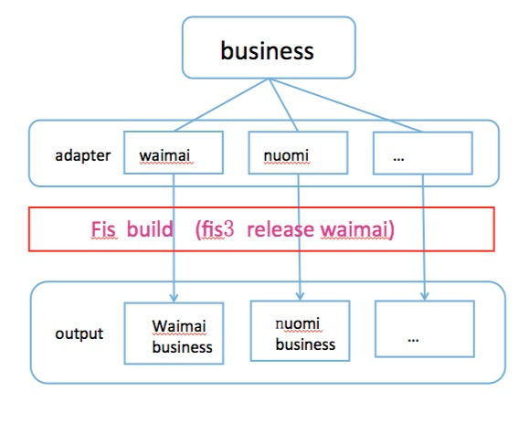
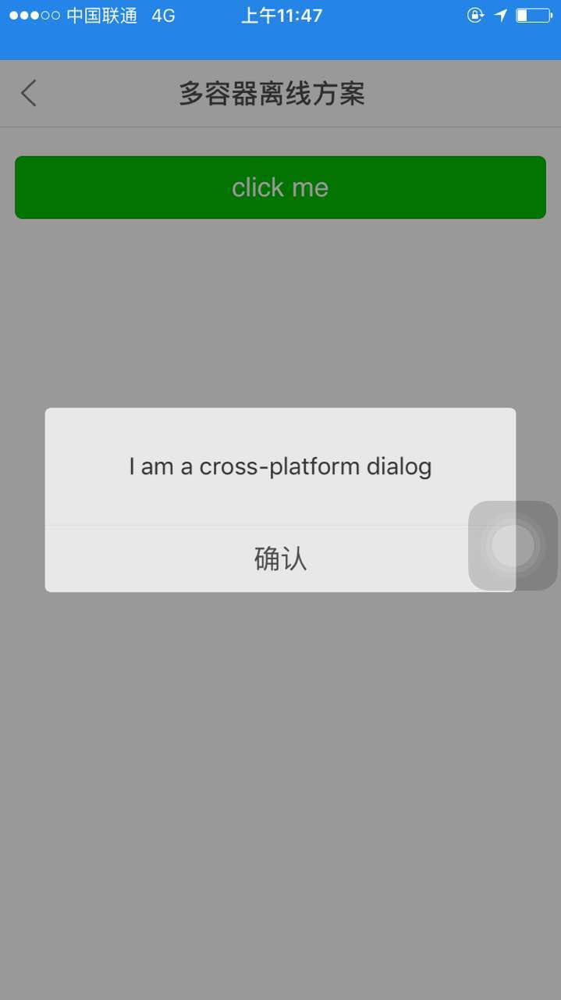

#cross-platform-h5-page
> 跨web容器Hybrid 离线组件结构设计。当前Hybrid大多是以native为主，H5为辅；而由于公司各业务线之间，资源互补或者业务重合，公司之间战略合作等，直接导致了H5和native之间已不在是one by one的关系；一份H5业务需要运行在不同的native容器，走向组件化，native也需要接入不同的H5业务，越来越平台化。在这种趋势下，如何让我们的H5页面在不同容器之间能够以最低的成本迁移？

## 技术栈

fis3 + vuejs + es6 + zepto
   

>###3. 目录结构：

```
--cross-platform-h5-page
----------- adapter           // NA适配器，对NA JSBridge 的简单封装，目的是为以后适配多个NA 客户端容易扩展。
----------- assets   			// 静态资源
----------- page     			// 页面入口
----------------- layout.jade // 页面基础类
----------------- xxx 			// 具体页面文件夹 ， 页面继承至 layout.jade 
----------- widget   			// 具体页面组件和公共组件
------------------- components // 公共组件目录
------------------- xxx 		// 具体页面组件
----------- fis-conf.js 		// fis 配置文件
----------- package.json 		// 项目信息，fis3 插件依赖信息
----------- README.md 			// 项目基本文档    
```

>###4. 实现方案

这里主要讨论的是离线组件方案.关于在线页面多容器方案，想了解的可以看这篇文章。[http://www.cnblogs.com/yexiaochai/p/5204847.html](http://www.cnblogs.com/yexiaochai/p/5204847.html);

离线组件和在线页面最大的不同是：

1.online 代码在编译期不知道将要运行在哪个容器，只有运行时才知道；

2.online H5代码在服务端，每个容器运行的是同一份代码；

而offline 本地编译，构建zip包，上传到各自容器的server端，再由容器的更新策略来下载zip包，每个平台代码都是独立的，即使是80%以上是相同代码。

特点决定方案。下面以fis3 为基础，构建工具看个人喜好以及公司整体决定。





核心是adapter层 ，adapter对业务提供统一的接口，而根据不同的容器具有不同的实现。 我们把90%的业务抽离出来，和 10%的容器接口分开；保证业务是容器无关的。这样才能达到跨容器的目的。

对于 外卖客户端容器中组件只需要：  fis3 release waimai .
	通过fis 配置来组装 adapter/waimai + business  => waimai business.

其他容器类推。

对于接入新的容器，我们的成本减少到只需要重新定义新的adapter 实现。	


>###5. 安装：

git clone https://github.com/liaobin312716/cross-platform-h5-page.git

npm install

npm start


>###6. TODO 

目前，外卖已经ok, 糯米下还没有走通，原因是 BNJSReady 事件没有触发，不知道是不是手机安装包问题，因为代码直接放到 糯米组件开放平台是没问题的。我后续再跟进一下。其他容器adapter也会陆续添加进来。一个问题最核心的是思路。感兴趣的大家可以自己也折腾一下。


